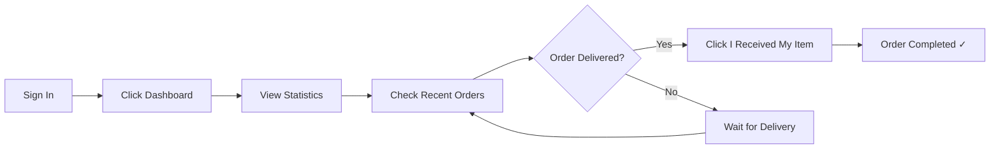

# 🎯 Customer Dashboard - Quick Reference

## ✨ What You Built

A complete customer experience with:

### 1. 📊 Dashboard (`/dashboard`)
```
┌─────────────────────────────────────────────────────┐
│  Dashboard                                          │
│  Welcome back! Here's an overview of your account. │
├─────────────┬─────────────┬─────────────┬──────────┤
│ Total Orders│ Pending     │ Completed   │ Total    │
│     12      │      3      │      8      │  85K RWF │
└─────────────┴─────────────┴─────────────┴──────────┘

┌────────────────────────────┬──────────────────────┐
│ Recent Orders              │ Quick Actions        │
│                            │                      │
│ Order #REF-001            │ 🛍️ Shopping         │
│ ● Delivered               │  → Browse Products   │
│ [I Received My Item]      │  → View Orders       │
│                            │                      │
│ Order #REF-002            │ 👤 Account           │
│ ● Shipped                 │  → Settings          │
│                            │                      │
│ Order #REF-003            │ 📦 Order Status      │
│ ● Pending                 │  Pending: 3          │
│                            │  Completed: 8        │
│ [View All Orders →]       │  [View All Orders]   │
└────────────────────────────┴──────────────────────┘
```

### 2. 📦 Order Tracking (`/orders`)
```
┌─────────────────────────────────────────────────────┐
│  My Orders                                          │
│  Track your order status and confirm receipt       │
│                                           [Refresh] │
├─────────────────────────────────────────────────────┤
│ [All] [Pending] [Shipped] [Delivered] [Completed]  │
├─────────────────────────────────────────────────────┤
│                                                     │
│  Order #REF-001            ● Delivered              │
│  Oct 20, 2025 - 14:30                              │
│                                                     │
│  📦 Items:                                          │
│  • Product A        2x @ 10,000 RWF               │
│  • Product B        1x @ 25,000 RWF               │
│  ────────────────────────────────────              │
│  💰 Total: 45,000 RWF                              │
│                                                     │
│  📍 Shipping:                                       │
│  123 Street, Kigali, Rwanda                        │
│                                                     │
│  📅 Timeline:                                       │
│  ✓ Confirmed     Oct 20, 10:00                    │
│  ✓ Shipped       Oct 20, 14:00                    │
│  ✓ Delivered     Oct 20, 18:00                    │
│                                                     │
│  Have you received your order?                     │
│  [✓ I Received My Item]                           │
│                                                     │
└─────────────────────────────────────────────────────┘
```

### 3. ⚡ Navigation (Logged In)
```
┌─────────────────────────────────────────────────────┐
│ Toolboxx                                            │
│  [Home] [Dashboard] [My Orders] [About] [Contact]  │
│                                      [Dashboard →] │
└─────────────────────────────────────────────────────┘
```

## 🚀 Key Features

### For Customers:
✅ **One-Click Access** - Dashboard button in navbar  
✅ **Live Statistics** - Real-time order counts and spending  
✅ **Order History** - Complete purchase records  
✅ **Status Tracking** - Visual timeline from purchase to delivery  
✅ **Receipt Confirmation** - One button to complete orders  
✅ **Mobile Responsive** - Works on all devices  

### For Tenants (Payload CMS):
✅ **Inline Verification** - Confirm payments without leaving table  
✅ **Received Indicator** - ✓ checkbox when customer confirms  
✅ **Status Management** - Update fulfillment stages  
✅ **Revenue Tracking** - Automatic updates on verification  

## 📱 User Flow



## 🎨 Components Used

### Statistics
- **StatCard** - Individual metric display
- **OrderStats** - Grid of 4 stats

### Orders
- **OrderCard** - Complete order details
- **OrderStatusBadge** - Visual status indicator
- **ConfirmReceiptButton** - Receipt confirmation

### Layout
- **DashboardView** - Main dashboard page
- **OrdersView** - Order history page

## 🔧 Technical Details

### Routes
- `/dashboard` - Customer dashboard
- `/orders` - Order tracking page

### API Endpoints (tRPC)
- `orders.getDashboardStats` - Fetch statistics
- `orders.getMyOrders` - Get order history
- `orders.confirmReceipt` - Mark as received

### Database
- **Orders.received** - Boolean field for confirmation
- **Transactions.verifyAction** - UI field for button

## 📊 Statistics Explained

### Total Orders
Count of all orders (any status)

### Pending Orders
Orders that are:
- ● Pending (payment verified, not shipped)
- ● Shipped (in transit)

### Completed Orders
Orders marked as:
- ● Completed (customer confirmed receipt)

### Total Spent
Sum of all order amounts (excludes cancelled)

## 🎯 Quick Actions Sidebar

### Shopping
- Browse All Products → `/`
- View My Orders → `/orders`

### Account
- Account Settings → `/admin`

### Order Status
- Real-time counts
- Quick link to orders

## 📖 Usage Examples

### Customer Checks Order:
```typescript
1. Login
2. Click "Dashboard" in navbar
3. See "Pending: 2" in stats
4. Scroll to "Recent Orders"
5. Click "View All" for complete list
```

### Customer Confirms Receipt:
```typescript
1. Go to /orders
2. Filter by "Delivered"
3. Find order
4. Click "I Received My Item"
5. Confirm in dialog
6. Order → Completed ✓
```

### Tenant Verifies Payment:
```typescript
1. Login to Payload CMS
2. Navigate to Transactions
3. Find "awaiting_verification" transaction
4. Click "Confirm Payment" button
5. Enter MTN Transaction ID
6. Click "Verify"
7. Order created automatically
```

## 🌟 Benefits

### For Business:
- Improved customer satisfaction
- Reduced support inquiries
- Automated order tracking
- Clear payment workflow
- Professional appearance

### For Customers:
- Easy access to information
- Clear order status
- Simple receipt confirmation
- Mobile-friendly interface
- Quick navigation

### For Developers:
- Type-safe code
- Reusable components
- Clean architecture
- Good documentation
- Easy maintenance

## 📚 Documentation

Full guides available:
- `CUSTOMER_DASHBOARD.md` - Dashboard details
- `CUSTOMER_ORDER_TRACKING.md` - Order system
- `COMPLETE_CUSTOMER_EXPERIENCE.md` - Full overview

## 🎉 Ready to Use!

Start the development server:
```bash
bun run dev
```

Visit:
- **App**: http://localhost:3000
- **Dashboard**: http://localhost:3000/dashboard (login required)
- **Orders**: http://localhost:3000/orders (login required)
- **Admin**: http://localhost:3000/admin

---

**Status**: ✅ Ready for Production  
**Last Updated**: October 23, 2025
